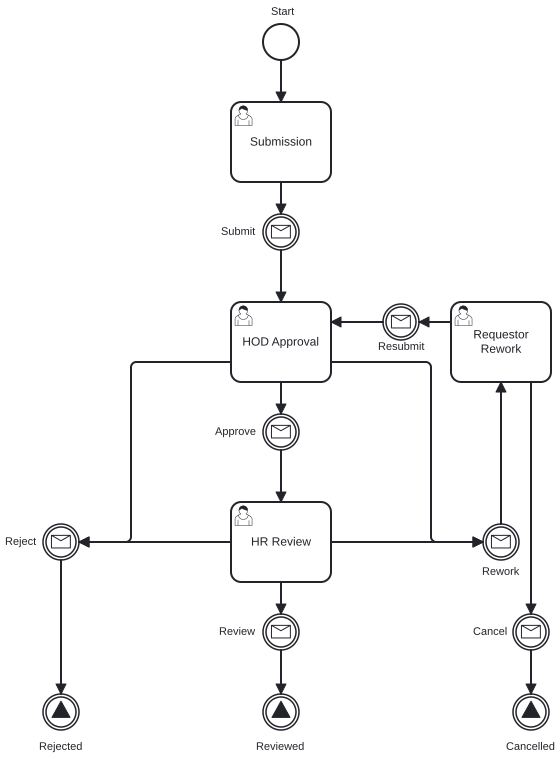
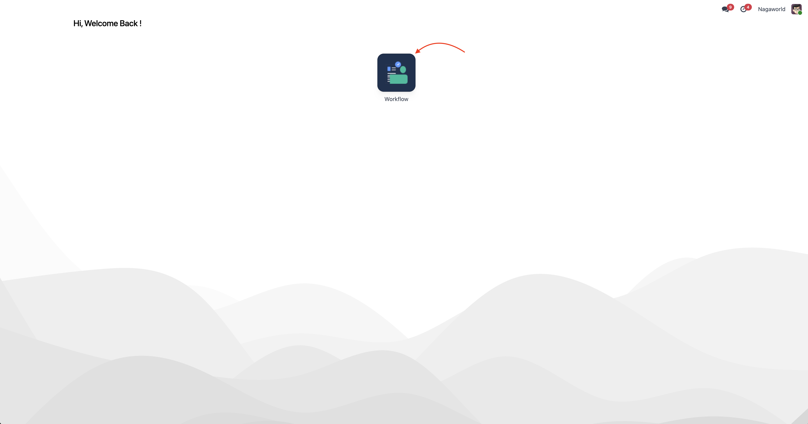
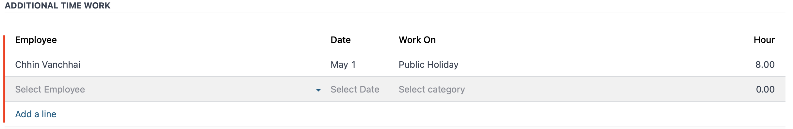
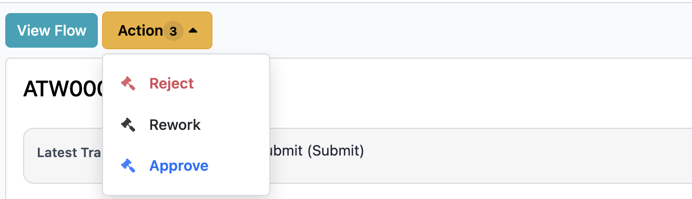
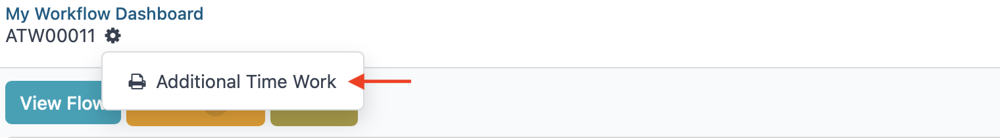

# Additional Time Work - User Guide

This guide explains how to use the Additional Time Work workflow.

**Roles covered:** Employee (Requester) · Manager or HoD (Approver) · HR Team (HR Review)

---

## Workflow Process

---

## Access the Workflow

1. Log in to the system.
2. Open the **Workflow** application.

---

## Requester

1. Click **New Request**.
2. Fill in the required information.
3. Click **Submit**.

---

## Approver & HR Review Actions

Find assigned requests under **My Contribute List** using the path for your role:

| Role | Menu Path | Action |
|------|-----------|--------|
| Approver | **Workflow** → **Additional Time Work** → **My Approvals** → **My Contribute List** | Enter a comment, then choose **Approve**, **Reject**, or **Rework**. |
| HR Review | **Workflow** → **Additional Time Work** → **My Requests** → **My Contribute List** | Review the request, then click **Close**. |

> **Tip:** You can also access assigned requests from the clock icon (top-right corner). Click **Today** to see requests that need your attention.

---

## Request Statuses

| Status | Meaning |
|--------|---------|
| Draft | Created but not yet submitted. |
| Waiting Approval | Pending manager or HoD approval. |
| Approved | Approved by manager or HoD; pending HR review. |
| Closed | Reviewed by HR and closed. |

---

## Notifications

You receive a notification when a request is submitted, approved, rejected, or sent back for rework.

---

## Track Request Progress

Open the request and click **View Flow** to see a visual summary of where it stands in the workflow.

---

## Delegation

If you need someone else to handle an approval, you have two options:

- **Redirect** — Transfers full approval authority to another person. The request is removed from your queue and assigned to them.
- **Share** — Adds another approver without removing you. Both of you can view and act on the request.

---

## Generate Report

To export a report of all requests:

1. Go to **Workflow** → **Additional Time Work**.
2. Click the gear icon (top-right corner).
3. Click **Additional Time Work Request Report**.

