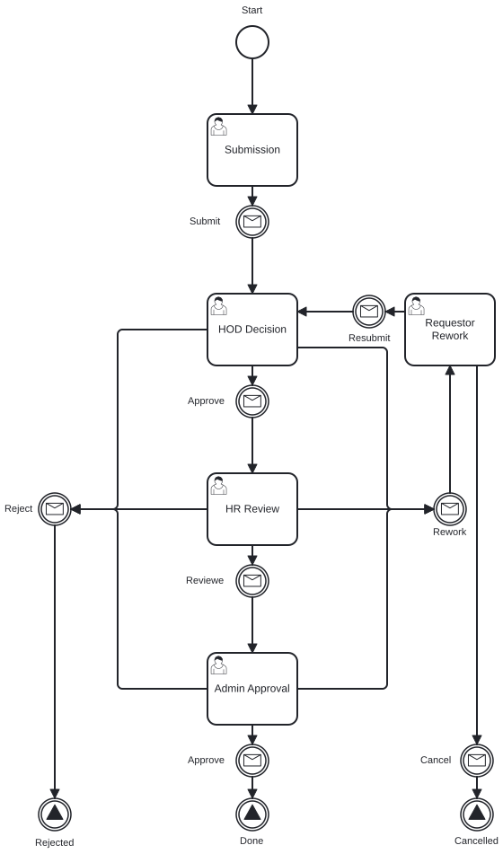
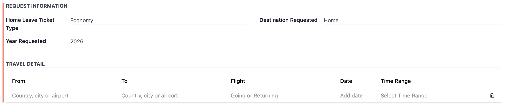
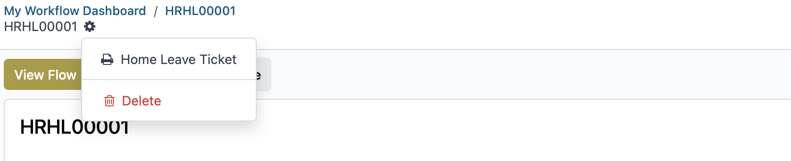
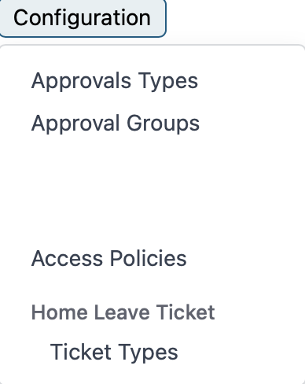
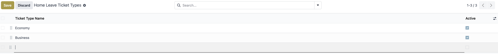

# Home Leave Ticket User Guide

This guide explains how to create, review, and complete Home Leave Ticket requests in the Workflow application.

## Roles

This workflow uses the following roles:

- Employee: creates and submits a request
- Manager or HoD: reviews requests and approves, rejects, or reworks them
- Admin: reviews and processes requests when required

## Workflow Process

    

## Access the Workflow

1. Log in to the system.
2. Open the Workflow app.

## Requester

1. Click **New Request**.
2. Fill in the required information.
3. Click **Submit**.

## Approver

1. Go to **Workflow** -> **My Approvals**.
2. Open **My Request List**.
3. Open a request assigned to you.
4. Enter a comment.
5. Choose one action:
    - **Approve**
    - **Reject**
    - **Rework**

You can also find assigned requests from the clock icon in the top-right corner. Select **Today** to see requests that need your action.

## Reference

### Statuses

| Status | Meaning |
|--------|---------|
| Draft | The request has been created but not submitted. |
| Waiting Approval | The request is waiting for Manager or HoD approval. |
| Approved | The request has been approved. |
| Rejected | The request has been rejected. |
| Reworked | The request has been sent back for changes. |

### Notifications

Users receive notifications when a request is submitted, approved, rejected, or reworked.

### Track Request Progress

Select **View Flow** to see the visual workflow progress.

### Delegation

There are two delegation options:

1. **Redirected**: Transfers full approval authority to another person. The request leaves your queue and moves to the selected approver.
2. **Share**: Keeps you as an approver and adds another person to help. Both of you can view and act on the request.

### Generate Report

To generate a report for Home Leave Ticket requests:

1. Open the Home Leave Ticket request list in the Workflow app.
2. Click the gear icon at the top-right corner.
3. Select the available print or export action for the current list.

## Configuration

To configure Home Leave Ticket workflow options:

1. Go to **Workflow** -> **Configuration**.
2. Open the relevant Home Leave Ticket configuration item.
3. Click **New** to add a new option.
4. Click **Save manually** to save your changes.

## Need Help?

For more information, contact the IT Helpdesk.

- Extension: **7889**