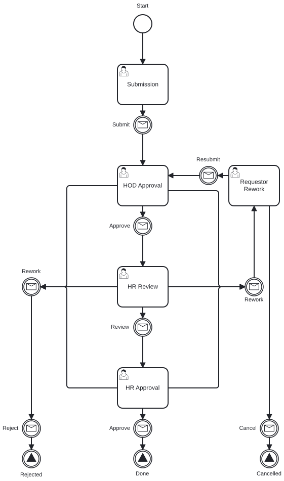
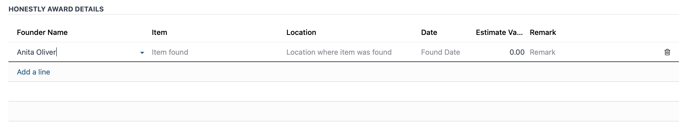
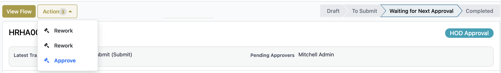
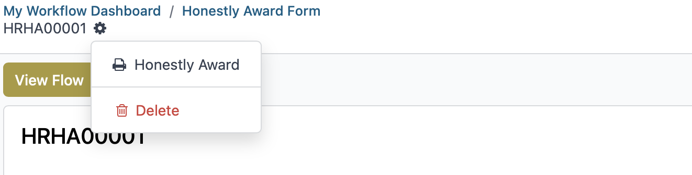

# Honestly Award User Guide

This guide explains how to create, review, and complete Honestly Award requests in the Workflow application.

## Who Uses This Guide

This workflow involves the following roles:

- Employee: creates and submits a request
- Manager or HoD: reviews and approves, rejects, or reworks the request
- Admin: reviews, approves, or issues requests when required

## Workflow Process

    

## Access the Workflow

1. Sign in to the system.
2. Open the Workflow app.

## Create a Request (Employee)

1. Click **New Request**.
2. Fill in all required fields.
3. Click **Submit**.

## Review a Request (Manager or HoD)

1. Go to **Workflow** -> **Honestly Award**.
2. Open **My Approvals** -> **My Request List**.
3. Add a comment.
4. Choose one action:
   - **Approve**
   - **Reject**
   - **Rework**

You can also open assigned requests from the clock icon in the top-right corner. Select **Today** to see items that need action.

## Notes

### Status Explanation

| Status | Meaning |
|--------|---------|
| Draft | The request is created but not submitted. |
| Waiting Approval | The request is waiting for Manager or HoD review. |
| Approved | The request is approved. |
| Rejected | The request is rejected. |
| Reworked | The request is returned to the requester for updates. |

### Notifications

Users receive notifications when a request is submitted, approved, rejected, or reworked.

### Track Request Progress

Click **View Flow** to see the request's workflow progress.

### Delegation

There are two delegation options:

1. **Redirected**: Transfers full approval authority to another person. The request leaves your queue and moves to the selected approver.
2. **Share**: Keeps you as an approver and adds another person to help. Both can view and act on the request.

### Generate Report

To generate a report for Honestly Award requests:

1. Go to **Workflow** -> **Honestly Award**.
2. Click the gear icon at the top-right corner.
3. Select the Honestly Award report option.

## Need Help?

For more information, contact the IT Helpdesk.

- Extension: **7889**