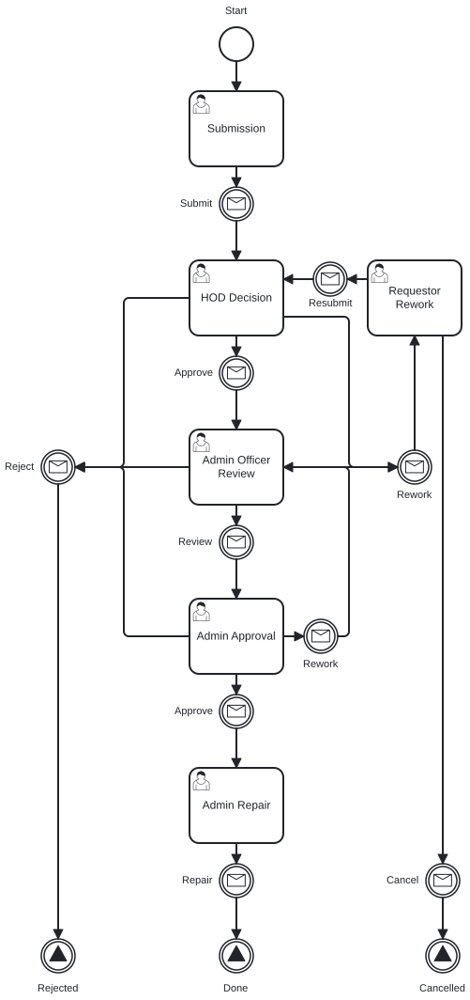
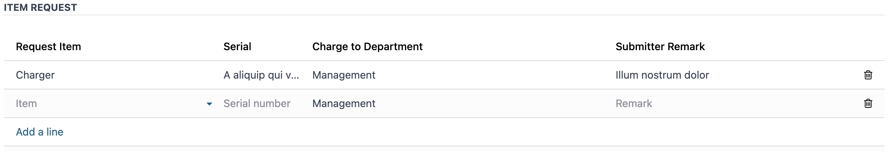
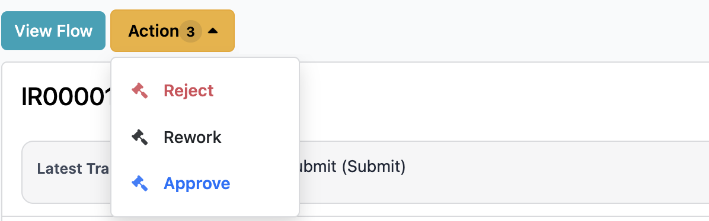
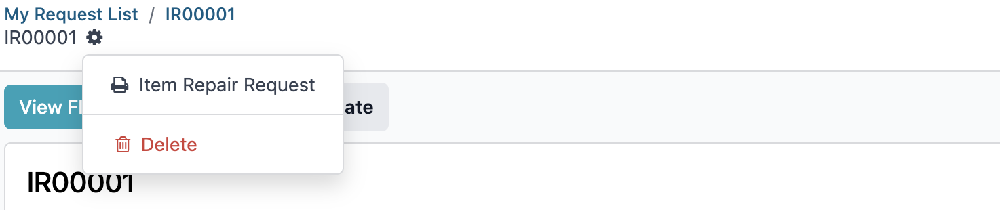
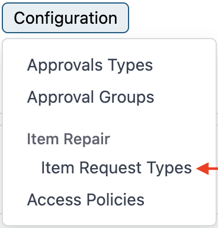
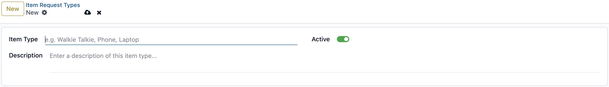

# Item Repair User Guide

This guide explains how to submit, review, and complete item repair requests in the Workflow application.

## Who Uses This Guide

The workflow is used by these roles:

- Employee: creates the request
- Manager or HoD: approves, rejects, or sends the request back for rework
- Admin: reviews and completes requests when required

## Workflow Process

    

## Access the Workflow

1. Log in to the system.
2. Open the Workflow app.

## Requester

1. Click **New Request**.
2. Fill in the required information.
3. Click **Submit**.

## Approver

1. Go to **Workflow** -> **Item Repair**.
2. Open **My Approvals** -> **My Request List**.
3. Open the request you want to review.
4. Enter a comment.
5. Choose one action:
   - **Approve**
   - **Reject**
   - **Rework**

## Complete a Request

Use this flow when an admin needs to finish the repair process.

1. Go to **Workflow** -> **My Requests**.
2. Open **My Request List**.
3. Open the assigned request.
4. Complete the repair details, then click **Repair**.

You can also use the clock icon at the top-right corner and select **Today** to see requests that need attention.

## Note
### Status Explanation

| Status | Meaning |
|--------|---------|
| Draft | The request has been created but not submitted. |
| Waiting Approval | The request is waiting for Manager or HoD approval. |
| Approved | The request has been approved. |
| Rejected | The request has been rejected. |
| Reworked | The request has been sent back for changes. |

### Notifications

Users receive notifications when a request is submitted, approved, rejected, or reworked.

### Track Request Progress

Select **View Flow** to see the visual workflow progress for the request.

### Delegation

There are two delegation options:

1. **Redirected**: Transfers full approval authority to another person. The request leaves your queue and moves to the selected approver.
2. **Share**: Keeps you as an approver and adds another person to help. Both of you can view and act on the request.

### Generate Report

To generate an Item Repair Request report:

1. Open an item repair request or request list.
2. Use the report or print action.
3. Select **Item Repair Request** or **Item Repair Request Form**.

## Configuration
To configure item repair setup data:

1. Go to **Workflow** -> **Configuration** -> **Item Repair**.
2. Open **Item Request Types**.
3. Click **New** to add a request type.
4. Save the record.

## Need Help?

For more information, contact the IT Helpdesk.

- Extension: **7889**