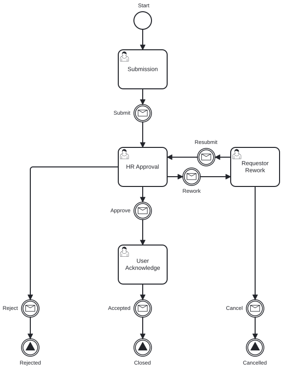
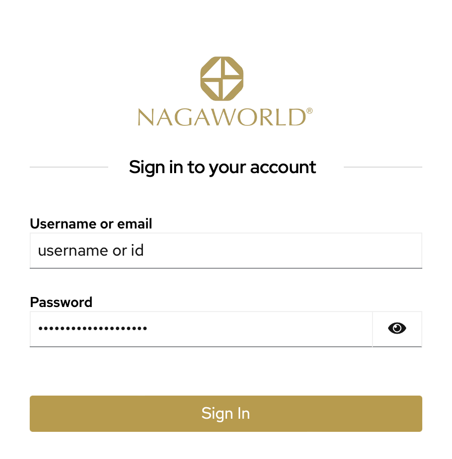
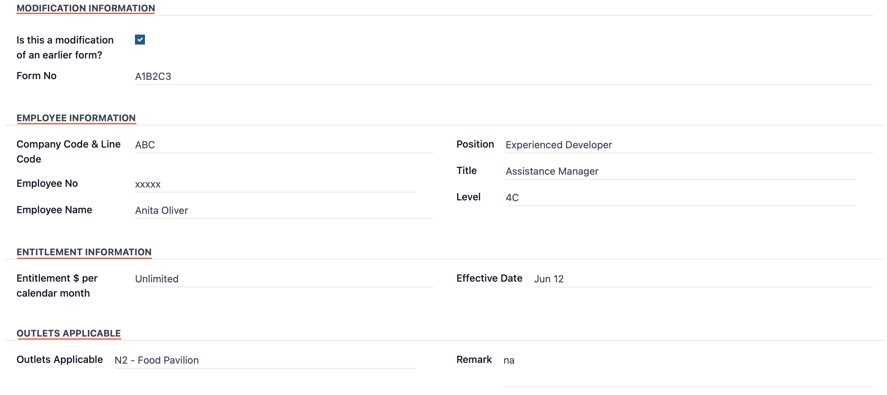
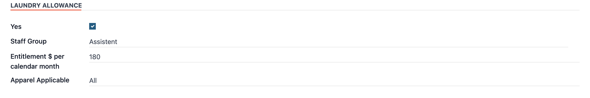
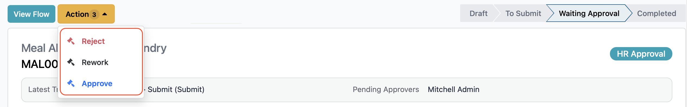
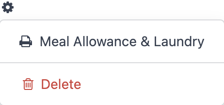
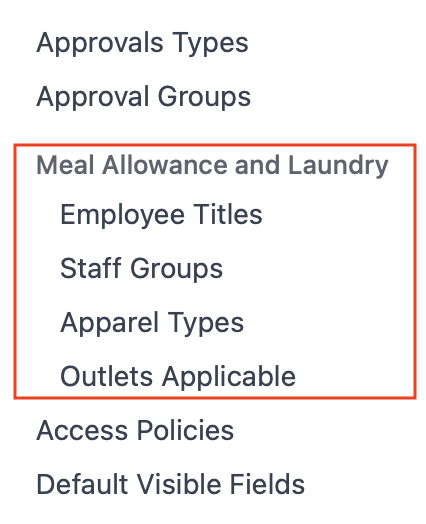
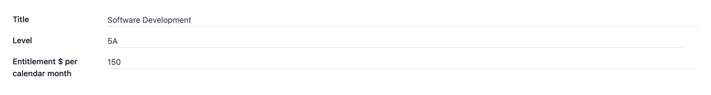

# Meal Allowance and Laundry User Guide

This guide explains how to create, review, and complete meal allowance and laundry requests in the Workflow application.

## Who Uses This Guide

The workflow supports three primary roles:
- **Employee:** Creates and submits requests.
- **Manager / HoD:** Approves, rejects, or sends requests back for rework.
- **Admin:** Reviews, approves, or issues requests when needed.

## Workflow Process

    

## Accessing the System

1. Log in to the system.
2. Open the **Workflow** application.

    

---

## For Requesters

1. Click **New Request**.
2. Fill in the required form information.
3. Click **Submit**.

---

## For Approvers

1. Go to **Workflow**.
2. Open **My Approvals** -> **My Contribute List** (or your pending queue).
3. Optional: Enter a comment in the text box.
4. Select one action:
   - **Approve**
   - **Reject**
   - **Rework**

> 💡 **Quick Tip:** You can also find your assigned requests by clicking the **Clock** icon in the top-right corner. Select **Today** to view pending items.

---

## Managing Requests

### Request Statuses

| Status | Meaning |
|--------|---------|
| **Draft** | The request is created but not yet submitted. |
| **Waiting Approval** | The request is waiting for Manager or HoD review. |
| **Approved** | The request has been finalized and approved. |
| **Rejected** | The request has been denied. |
| **Reworked** | The request was sent back to the creator for updates. |

### Tracking & Notifications
* **Notifications:** You will receive automated updates when a request is submitted, approved, rejected, or reworked.
* **Progress Tracking:** Click **View Flow** on any request to see its visual progress in the workflow.

### Delegating Approvals
If you need someone else to handle your approvals, choose one of these options:
1. **Redirected:** Transfers full authority to another person. The request leaves your queue entirely.
2. **Share:** Keeps you as an approver but adds a colleague to help. Either person can take action.

---

## Reports & Configuration

### Generate Reports
1. Navigate to **Workflow** -> **Meal Allowance and Laundry**.
2. Click the **Gear** icon in the top-right corner.
3. Select **Meal Allowance & Laundry** to download the report.

### System Configuration (Admin Only)
1. Go to **Workflow** -> **Configuration**.
2. Open **Employee Title**.
3. Click **New** to add new properties.
4. Click **Save manually** to commit your changes.

---

## Need Help?

If you have questions or encounter issues, please contact the IT Helpdesk.

* **Internal Extension:** 7889