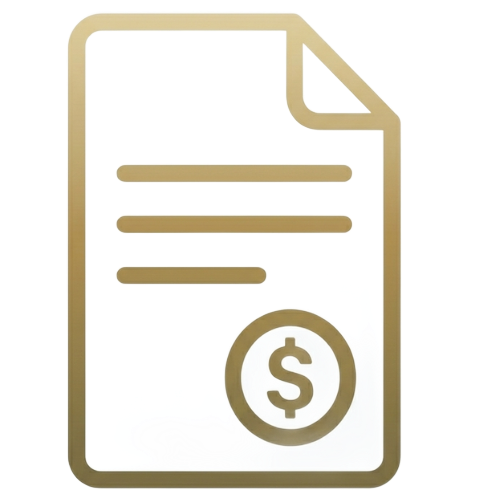

# Purchase Request
Project type: Workflow Module

Tech stack: Odoo 19.0, Python, PostgreSQL


## Project overview
This module manages purchase requests. It collects request details and stores data for review and approval.

## Features
- Create purchase requests
- Track request status
- Store request details and history

## Requirements
- Odoo 19.0
- Python 3.x
- PostgreSQL

## Installation steps
1. Copy this module to your Odoo addons path.
2. Update the apps list in Odoo.
3. Install the module from the Apps menu.
4. Verify `wkhtmltopdf` is installed (for PDF reports)

## Configuration
No extra configuration is required.

## How to use
1. Open the module in Odoo.
2. Create a new purchase request.
3. Fill in request details.
4. Submit and follow the request status.

## Run unit tests
Run this command:

```cd purchase_request && python3 tests/test_purchase_request_standalone.py -v```

## Folder structure
- models/schema/ : `ir.model` and `ir.model.fields` definitions
- security/ : access rules (`ir.model.access.csv`)
- actions/ : window actions
- views/ : list/form/search UI views
- menus/ : menu items
- workflows/ : workflow category and BPMN version
- reports/ : report action and QWeb template
- data/demo/ : demo records
- tests/ : test files