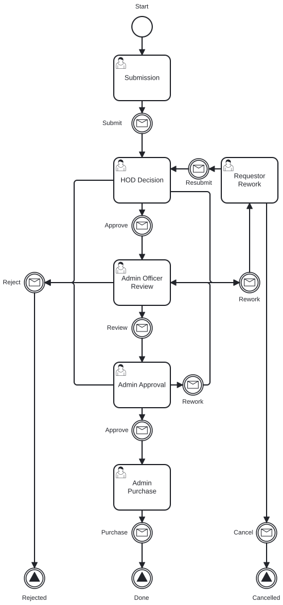
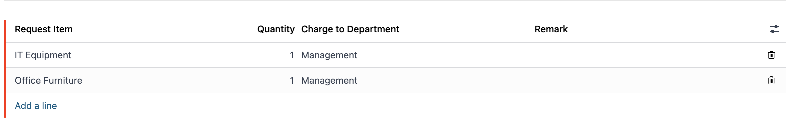
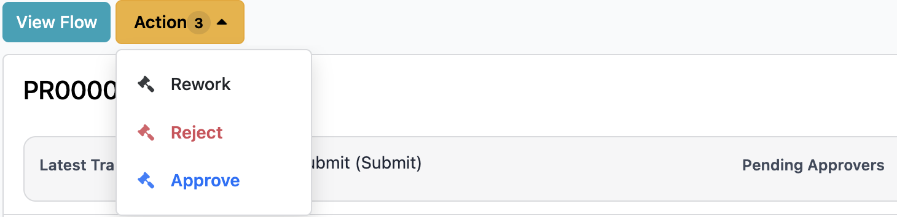
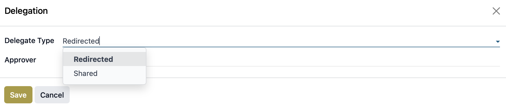
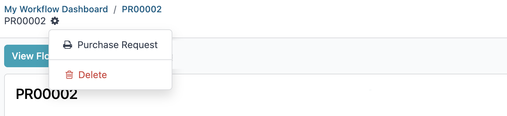
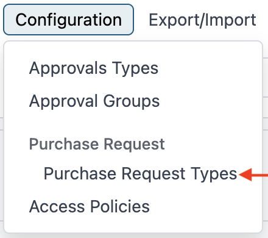
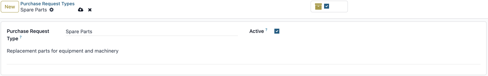

# Purchase Request User Guide

This guide explains how to create, review, and complete Purchase Request records in the Workflow application.

## Who Should Use This Guide

- Requesters (employees) who submit requests
- Approvers (Manager or HoD) who approve, reject, or send back requests
- Admin users who complete the purchasing step

## Workflow Overview

    

## Access the Workflow App

1. Log in to the system.
2. Open the **Workflow** app.

## Submit a Request (Requester)

1. Click **New Request**.
2. Enter request details.
3. Add line items in **Request Information**.
4. Add vendor details in **Vendor Information**.
5. Click **Submit**.

## Review a Request (Approver)

1. Go to **Workflow** -> **Purchase Request**.
2. Open **My Approvals** -> **My Request List**.
3. Open a request and enter your comment.
4. Choose one action:
- **Approve**
- **Reject**
- **Rework**

## Complete Purchasing (Admin)

1. Go to **Workflow** -> **My Requests**.
2. Open **My Request List**.
3. Complete purchase details in **Purchase Information**.
4. Click **Purchase** when finished.

Tip: You can also open assigned tasks from the clock icon at the top-right and select **Today**.

## Reference

### Status Meaning

| Status | Meaning |
|--------|---------|
| Draft | Request is created but not submitted. |
| Waiting Approval | Request is waiting for Manager or HoD decision. |
| Approved | Request is approved and ready for next step. |
| Rejected | Request is rejected and closed. |
| Reworked | Request is returned to requester for updates. |

### Notifications

Users receive notifications when a request is submitted, approved, rejected, or reworked.

### Track Progress

Click **View Flow** to see the current workflow step.

### Delegation

There are two delegation options:

1. **Redirected**: Transfers full approval authority to another user.
2. **Share**: Adds another approver while keeping you as an approver.

## Generate Report

To print a Purchase Request report:

1. Open a Purchase Request record.
2. Click **Print**.
3. Select **Purchase Request Form**.

## Configuration

To manage request item types:

1. Go to **Workflow** -> **Configuration** -> **Purchase Request**.
2. Open **Purchase Request Types**.
3. Click **New** to add a type.
4. Click **Save**.

## Need Help?

Contact IT Helpdesk:

- Extension: **7889**