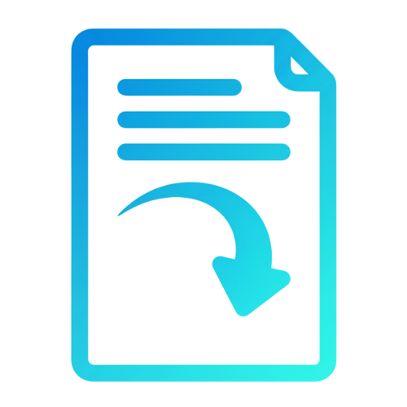

# Request Document
Project type: Workflow Module
Tech stack: Odoo 19.0, Python, PostgreSQL


## Project overview
This module manages document requests with a workflow approval flow. It captures request details, drives approvals, and generates a PDF report.

## Features
- Create document requests
- Track request status
- Store request details and history
- Workflow approval category and BPMN definition
- PDF report for request output

## Requirements
- Odoo 19.0
- Python 3.x
- PostgreSQL

## Installation steps
1. Copy this module to your Odoo addons path.
2. Update the apps list in Odoo.
3. Install the module from the Apps menu.
4. Verify `wkhtmltopdf` is installed (for PDF reports)

## Configuration
No extra configuration is required.

## How to use
1. Open the module in Odoo.
2. Create a new document request.
3. Fill in request details.
4. Submit and follow the request status.

## Run unit tests
Run the standalone logic test:
```bash
python3 modules/workflow/admin_forms/request_document/tests/test_request_document_standalone.py -v
```

## Folder structure
- models/schema/ : ir.model and ir.model.fields definitions
- security/ : access rules
- actions/ : window actions
- views/ : list and form view definitions
- menus/ : module menu items
- workflows/ : workflow category and BPMN version
- reports/ : report action and QWeb template
- tests/ : test files
