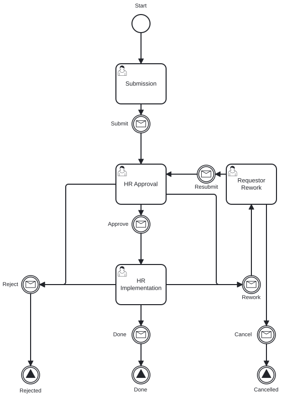
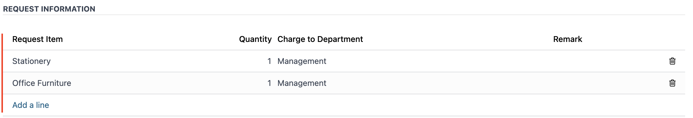
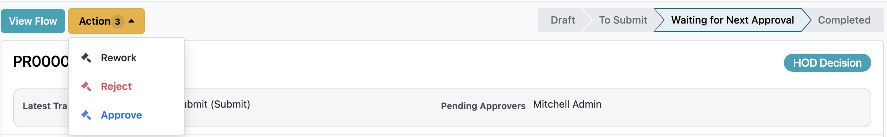
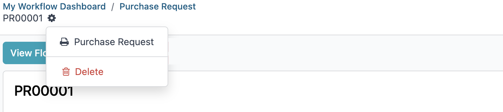

# Request Document User Guide

This guide explains how to create, review, and complete document requests in the Workflow application.

## Who Uses This Guide

The workflow supports these roles:

- Employee, who creates the request
- Manager or HoD, who approves or reworks the request
- Admin, who reviews, approves, or issues requests when required

## Workflow Process

    

## Access the Workflow

1. Log in to the system.
2. Open the Workflow app.

## Requester

1. Click **New Request**.
2. Fill in the required information.
3. Click **Submit**.

## Approver

1. Go to **Workflow** -> **Document Request**.
2. Open **My Approvals** -> **My Request List**.
3. Enter a comment.
4. Choose one action:
   - **Approve**
   - **Reject**
   - **Rework**

## Issue a Request

Use this flow when an admin needs to complete the request issuance step.

1. Go to **Workflow** -> **My Requests**.
2. Open **My Request List**.
3. Complete the task, then click **Issue**.

You can also find assigned requests from the clock icon at the top-right corner. Select **Today** to see requests that need attention.

## Note
### Status Explanation

| Status | Meaning |
|--------|---------|
| Draft | The request has been created but not submitted. |
| Waiting Approval | The request is waiting for Manager or HoD approval. |
| Approved | The request has been approved. |
| Rejected | The request has been rejected. |
| Reworked | The request has been sent back for changes. |

### Notifications

Users receive notifications when a request is submitted, approved, rejected, or reworked.

### Track Request Progress

Select **View Flow** to see the visual workflow progress.

### Delegation

There are two delegation options:

1. **Redirected**: Transfers full approval authority to another person. The request leaves your queue and moves to the selected approver.
2. **Share**: Keeps you as an approver and adds another person to help. Both of you can view and act on the request.

## Generate PDF Report

1. Open the Request Document record.
2. Click Print.
3. Select Request Document.

## Need Help

Contact IT Helpdesk:

- Extension: 7889