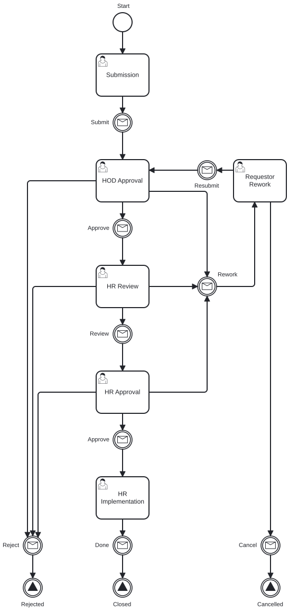
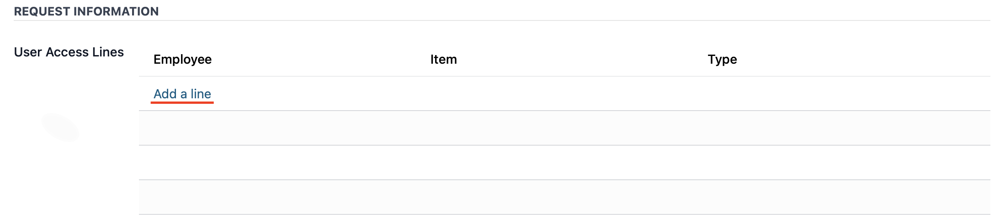
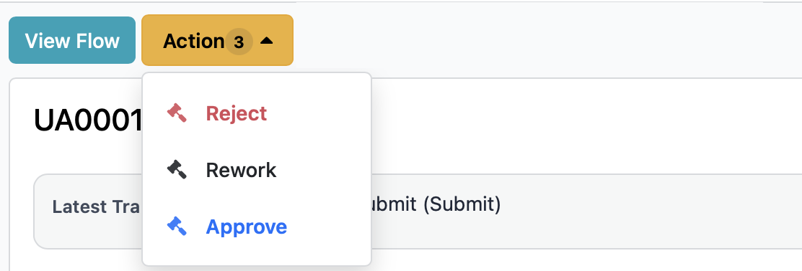
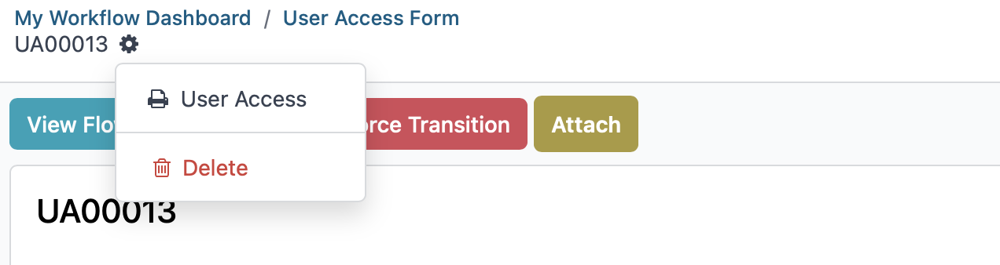
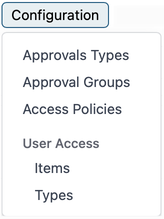

# User Access User Guide

This guide explains how to create, review, approve, and complete user access requests using the Workflow app. It is written for requesters, approvers, and HR staff.

## Roles

- Employee: creates the request
- HOD: reviews and approves or requests changes
- HR Review: verifies HR-related details
- HR Approval: gives final approval
- HR Implementation: applies the approved access and closes the request

## Workflow Overview

	

The main stages are: Submission → HOD Approval → HR Review → HR Approval → HR Implementation → Closed

## Access the Workflow

1. Log in to the system.
2. Open the Workflow app.

## Requester: Create a New Request

1. Click **New Request**.
2. Fill the required fields (requester, employee, reason, etc.).
3. Add one or more access lines (employee, item, type).
4. (Optional) Add a comment to explain the request.
5. Click **Submit**.

Keep attachments and comments concise so approvers can review quickly.

## Approver: Review and Take Action

1. Go to **Workflow** → **User Access** → **My Approvals** → **My Contributions List** (or use the Approvals dashboard).
2. Open a request from your queue and review details and attachments.
3. Add a comment if needed.
4. Choose an action:
   - **Approve** — move the request to the next stage
   - **Rework** — send the request back to the requester for changes
   - **Reject** — decline the request

When you choose **Rework**, include clear instructions so the requester can address issues quickly.

## Request Rework (for Requester)

1. Open the reworked request from **My Requests** → **My Contributions List** or your notifications.
2. Read the approver's comments.
3. Update fields or attachments as requested.
4. Submit the request again.

## HR Implementation: Complete the Request

1. Go to **Workflow** → **My Requests** → **My Contributions List** (or check assigned tasks/Today view).
2. Open the approved request and perform the required implementation steps.
3. Mark the task as complete and close the request.

You can also find assigned requests from the clock icon at the top-right corner and select **Today** to view items needing action.

## Statuses

| Status | Meaning |
|--------|---------|
| Submission | Request has been created and submitted. |
| HOD Approval | Waiting for HOD review. |
| HR Review | Waiting for HR verification. |
| HR Approval | Waiting for final HR approval. |
| HR Implementation | Waiting to be implemented by HR. |
| Reworked | Sent back to requester for changes. |
| Rejected | Request was declined. |
| Closed | Request has been implemented and closed. |

## Notifications & Tracking

- Users receive notifications at each stage (submitted, approved, reworked, rejected, completed).
- To see the current flow for a request, open it and select **View Flow**.

## Delegation

Two delegation options are available:

1. Redirected: transfers full approval authority to another person; the request moves out of your queue.
2. Share: adds another user to help with approvals while you remain an approver.

### Generate Report

To generate a report of all requests:

1. Go to **Workflow** -> **User Access**.
2. Click the gear icon at the top-right corner.
3. Click **User Access**.

## Configuration

To manage workflow configuration:

1. Go to **Workflow** → **Configuration** → **User Access**.
2. Manage **Items** and **Types** as needed.
3. Click **New** to add records and **Save** to persist changes.

## Need Help?

Contact the IT Helpdesk for assistance.

- Extension: 7889
